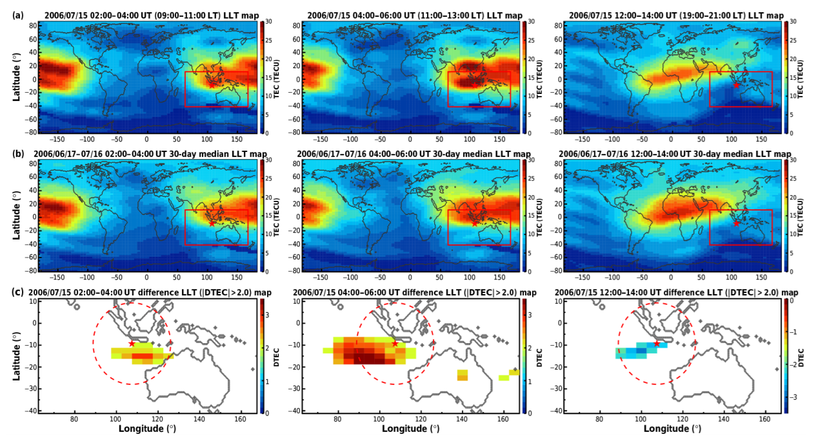
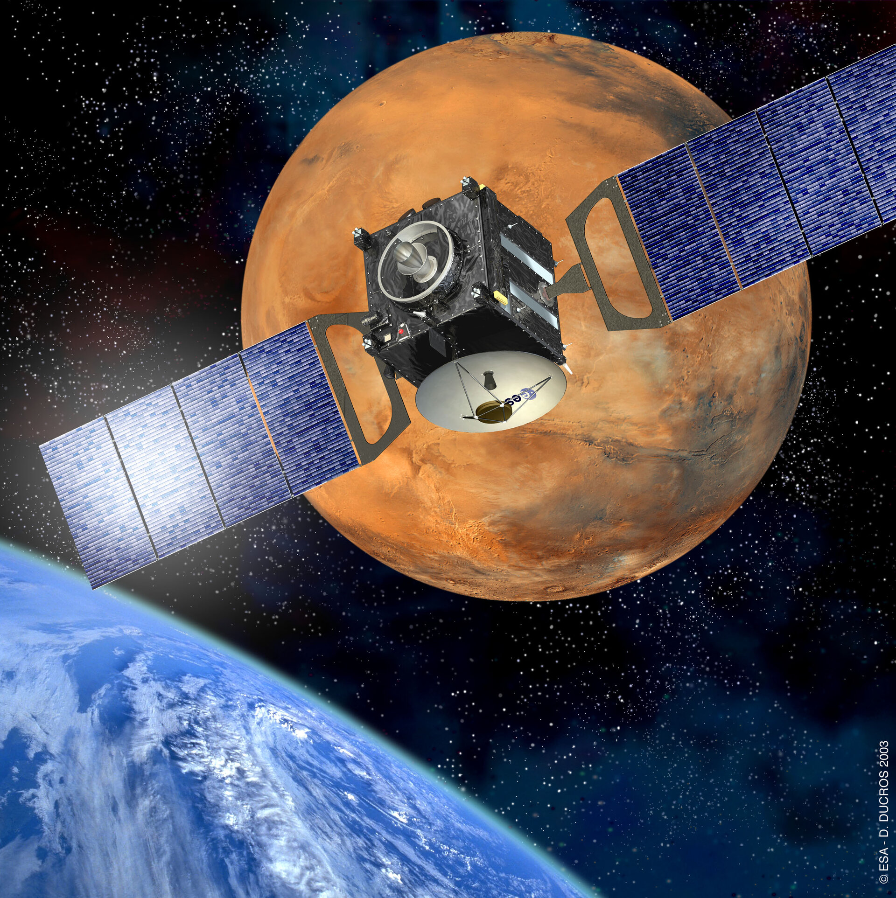

 Welcome to my homepage! I am Yuanzheng Wen (文渊正) or Kingsley, currently an undergraduate student at Department of Geophysics and Space Sciences, School of Geophysics, Chengdu University of Technology, China.
 
 I will try to keep my website frequently updated and make it better! 
 
 You can also follow my Github, Twitter and Facebook in the "Follow" section. 
 
## Research Interests
As an undergraduate student, I am still exploring my research interests, as for now I have been involved in research about

- [Seismic Ionospheric Anomalies](#seismic-ionospheric-anomalies)
- [MHD Simulation of Solar Wind Interaction with Mars](#mhd-simulation-of-solar-wind-interaction-with-mars)
- [Investigations of Martian Tail Boudary Layer with Mars Express ASPERA-3](#investigations-of-martian-tail-boundary-layer-with-mars-express-aspera-3)

### Seismic Ionospheric Anomalies

Earthquakes can excite atmospheric and ionospheric disturbances by dynamic coupling: vertical vibrations of the Earth’s surface launch pressure waves in the neutral atmosphere that grow in amplitude by several orders of magnitude as they attain ionospheric heights. Thus ionospheric anomalies can be regarded as an earthquake precursor, I am working with Dr. Dan Tao to investigate the Total Electron Content (TEC) and plasma parameters (electron, ion density and temperature) anomlies prior to earthquakes and aim to find out the correlations between ionospheric anomalies and strong earthquakes. The project is finished, manuscript has been submitted to <a href="https://earth-planets-space.springeropen.com/">Earth, Planets and Space.

 

 <em> A diagram demonstrating TEC anomlies before 2006 M7.7 Java earthquake. Figure sourced from <a href="https://angeo.copernicus.org/articles/35/589/2017/angeo-35-589-2017.pdf">Tao et al., 2017</a>.</em> 

### MHD Simulation of Solar Wind Interaction with Mars

The Mars of several billion years ago is a very differnt Mars than that of today. Several billion years ago, Mars was geologically active from core to crust, possessed a much thicker atmosphere, and had an internally produced magnetic field. The solar wind interaction with Mars plays a crucial role in Martian atmospheric evolution. Through the "Undergraduates Research Program" funded by Chinese Academy of Sciences (CAS), I am able to work with Dr.Yiteng Zhang at National Space Science Center (NSSC) on MHD simulation of solar wind interaction with Mars (ion escape process) to gain a better understanding of Martian atmopsheric escape process and planetary evolution history. 

 

 <em> Artist's impression of solar wind interaction with the current Mars space environment. Image courtesy of <a href="https://www.nasa.gov/press-release/nasa-mission-reveals-speed-of-solar-wind-stripping-martian-atmosphere/">NASA Goddard Space Flight Center.</a> </em> 

### Investigations of Martian Tail Boundary Layer with Mars Express ASPERA-3

In spaceraft (MEX, MAVEN) statistical data we can see a broad region of mixing of solar wind and planetary ions at the boundary of the Martian tail. From statistics we cannot tell if this is flaring, ie.e the tail boundary moves back and forth, so that the average becomes mixed, or a true mixing of plasma. The latter would be.a signature of boundary mixing processes like the Kelvin Helmholtz instability. Using moment data this is straightforward to investigate. Moment data from Mars Express does have some shortcomings to get accurate absolute numbers, mainly because of a partial field of view. We have better coverage tail data going deeper in the tail and also for a much longer time period from the Mars Express Aspera-3 IMA instrument, which will be used in our investagtions.

 

 <em> Mars Express, which has been orbiting around Mars for about 18 years, had told us a lot about the space environment of Mars. Image courtesy of <a href="https://www.esa.int/Space_in_Member_States/United_Kingdom/Mars_Express_how_to_be_fastest_to_the_Red_Planet">European Space Agency.</a> </em> 

## Visitors

