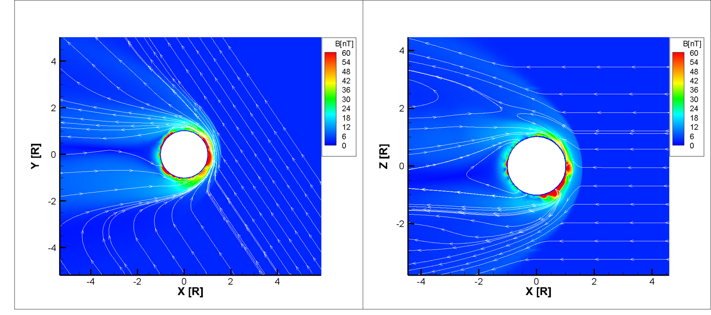
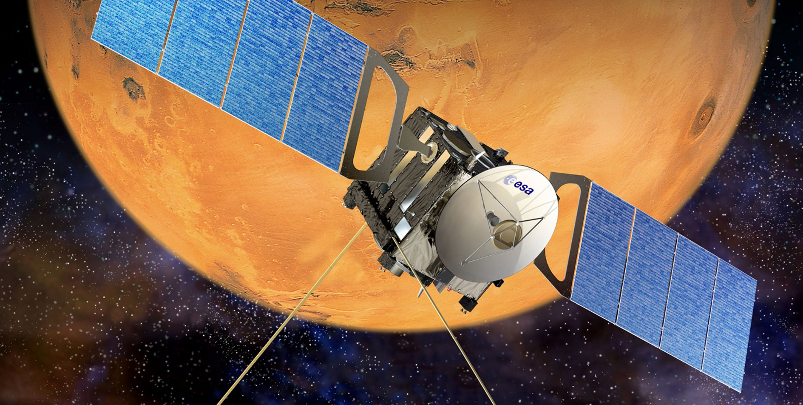
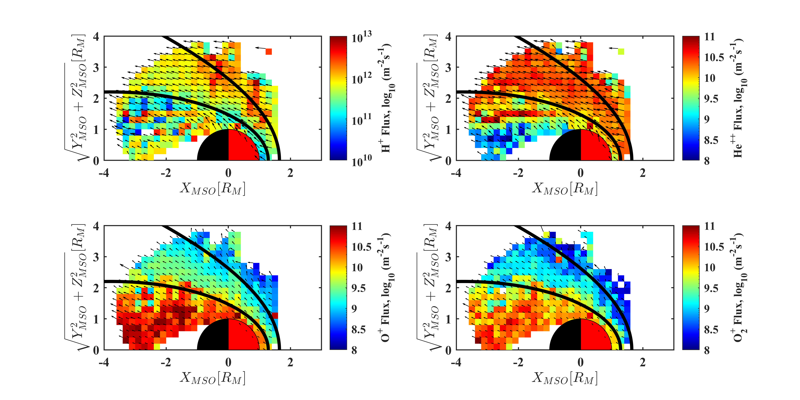
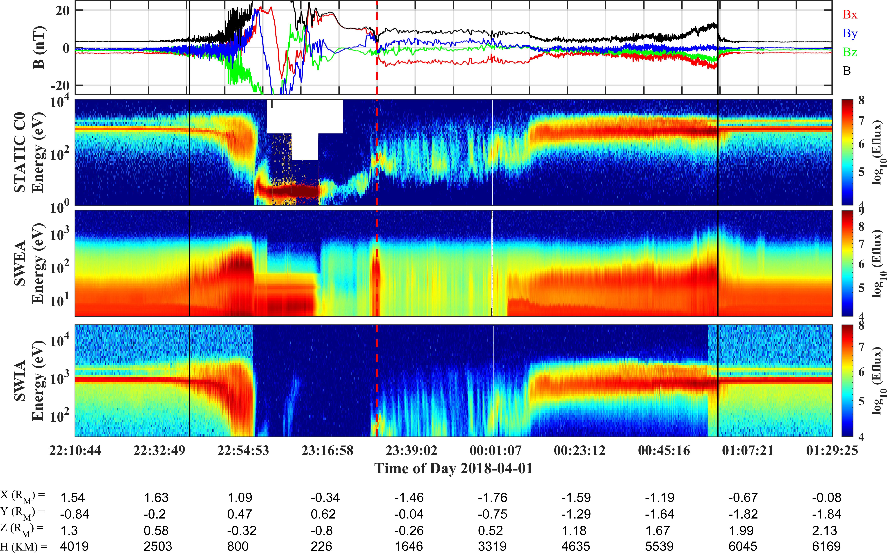
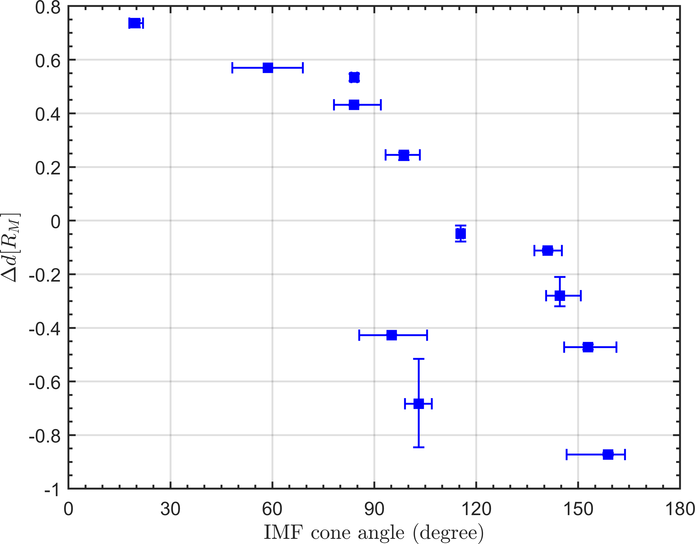
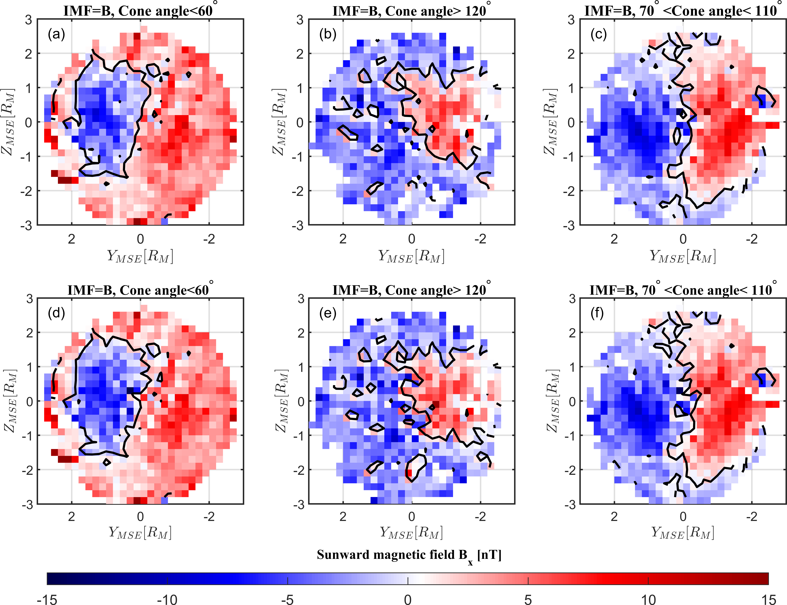
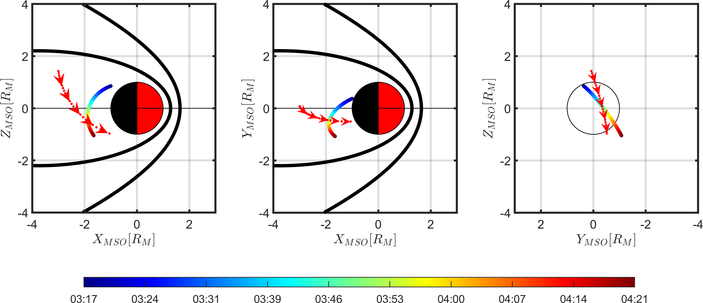
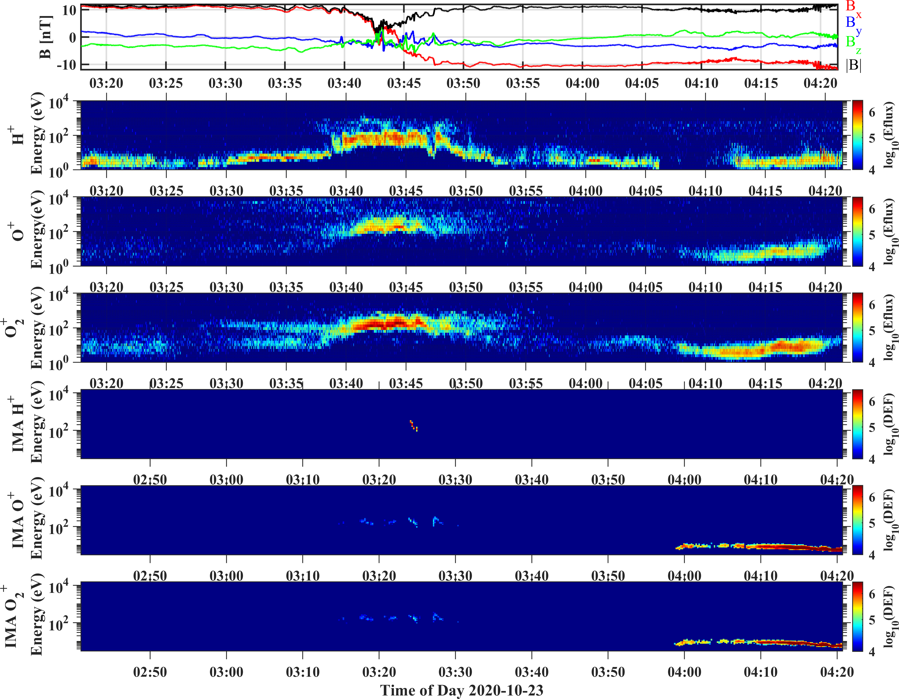

 Welcome to my homepage! I am Yuanzheng Wen (文渊正) or Kingsley, currently an undergraduate student at Department of Geophysics and Space Sciences, School of Geophysics, <a href="http://www.cdut.edu.cn/">Chengdu University of Technology</a> , China.
 
 I will try to keep my website frequently updated and make it better! 
 
 You can also follow my Github, Twitter and Facebook in the "Follow" section. 
 
## Research Projects
As an undergraduate student, I am still exploring my research interests, as for now I have been involved in research about

- [Seismic Ionospheric Anomalies](#seismic-ionospheric-anomalies)
- [MHD Simulation of Solar Wind Interaction with Mars](#mhd-simulation-of-solar-wind-interaction-with-mars)
- [Investigations of Martian Tail Boudary Layer with Mars Express ASPERA-3](#investigations-of-martian-tail-boundary-layer-with-mars-express-aspera-3)
- [Statistical Study of IMF Impact on the Current Sheet Structure in Martian Magnetotail](#statistical-study-of-imf-impact-on-the-current-sheet-structure-in-martian-magnetotail)
- [Joint Observations of Tail Ion Escape from MAVEN and MEX](#joint-observations-of-tail-ion-escape-from-maven-and-mex)

### Seismic Ionospheric Anomalies

Earthquakes can excite atmospheric and ionospheric disturbances by dynamic coupling: vertical vibrations of the Earth’s surface launch pressure waves in the neutral atmosphere that grow in amplitude by several orders of magnitude as they attain ionospheric heights. Thus ionospheric anomalies can be regarded as an earthquake precursor, I am working with Dr. Dan Tao to investigate the Total Electron Content (TEC) and plasma parameters (electron, ion density and temperature) anomlies prior to earthquakes and aim to find out the correlations between ionospheric anomalies and strong earthquakes.The paper has been published by <a href="http://doi.org/10.26464/epp2022028">Earth and Planetary Physics</a> and another one has been published by <a href="https://www.mdpi.com/2072-4292/14/9/2211">Remote Sensing</a> . The papers are available at <a href="http://yuanzhengwen.github.io/files/RA305.pdf">here</a> and <a href="http://yuanzhengwen.github.io/files/remotesensing-14-02211-v2.pdf">here</a>.

 

 <em> A diagram demonstrating TEC anomlies before 2006 M7.7 Java earthquake. Figure sourced from <a href="https://angeo.copernicus.org/articles/35/589/2017/angeo-35-589-2017.pdf">Tao et al., 2017</a>.</em> 

### MHD Simulation of Solar Wind Interaction with Mars

The Mars of several billion years ago is a very differnt Mars than that of today. Several billion years ago, Mars was geologically active from core to crust, possessed a much thicker atmosphere, and had an internally produced magnetic field. The solar wind interaction with Mars plays a crucial role in Martian atmospheric evolution. Through the "Undergraduates Research Program" funded by Chinese Academy of Sciences (CAS), I am able to work with Dr.Yiteng Zhang at  <a href="http://www.nssc.ac.cn/"> the National Space Science Center (NSSC)</a> on MHD simulation of solar wind interaction with Mars (ion escape process) to gain a better understanding of Martian atmopsheric escape process and planetary evolution history. The final presentation of the project at NSSC is available <a href="http://yuanzhengwen.github.io/files/NSSC_Presentation.pdf"> here </a>. 

 

 <em> Artist's impression of solar wind interaction with the current Mars space environment. Image courtesy of <a href="https://www.nasa.gov/press-release/nasa-mission-reveals-speed-of-solar-wind-stripping-martian-atmosphere/">NASA Goddard Space Flight Center.</a> </em> 

  
 
 
 
 <em> MHD simulation of solar wind interaction with Mars. Image courtesy of Yuanzheng Wen. </em> 

### Investigations of Martian Tail Boundary Layer with Mars Express ASPERA-3
  
In spacecraft (MEX, MAVEN) statistical data we can see a broad region of mixing of solar wind and planetary ions at the boundary of the Martian tail. From statistics we cannot tell if this is flaring, ie.e the tail boundary moves back and forth, so that the average becomes mixed, or a true mixing of plasma. The latter would be.a signature of boundary mixing processes like the Kelvin Helmholtz instability. Using moment data this is straightforward to investigate. Moment data from Mars Express does have some shortcomings to get accurate absolute numbers, mainly because of a partial field of view. We have better coverage tail data going deeper in the tail and also for a much longer time period from the Mars Express  <a href="http://aspera-3.irf.se/">ASPERA-3</a> IMA instrument, which will be used in our investagtions. I am collaborating with <a href="https://scholar.google.com/citations?user=37m29h8AAAAJ&hl=en&oi=ao">Prof. Hans Nilsson</a> and <a href="https://scholar.google.com/citations?hl=en&user=KTB3pgYAAAAJ">Prof. Mats Holmstrom</a> at <a href="https://www.irf.se/en/">the Swedish Institute of Space Physics (IRF)</a> on this exciting project.

 

 <em> Mars Express, which has been orbiting around Mars for about 18 years, had told us a lot about the space environment of Mars. Image courtesy of <a href="https://www.esa.int/Space_in_Member_States/United_Kingdom/Mars_Express_how_to_be_fastest_to_the_Red_Planet">European Space Agency.</a> </em> 

 

 <em> Example of spatial distributions of solar wind ions and planetary ions in the vicinity of Martian space environment derived from Mars Express ASPERA-3 IMA moment data.(Image Courtsey of Yuanzheng Wen).</em> 

  
### Statistical Study of IMF Impact on the Current Sheet Structure in Martian Magnetotail
An earlier statistical survey suggested that the flow-aligned component of upstream interplanetary magnetic field (IMF) may play an important role in controlling the lobe asymmetries of the Venusian magnetotail (McComas et al., 1986). The tail current sheet would be displaced and the magnetic field configuration would show asymmetries with respect to the current sheet. The asymmetries are expected to be more evident when the flow-aligned component becomes dominant. With carefully selected cases as well as a statistical study based on <a href="https://lasp.colorado.edu/home/maven/">MAVEN</a> observations in the near-Mars tail, we intend to investigate the flow-aligned component of IMF impact on current sheet structure in the Martian magnetotail (with crustal fields, solar EUV and other parameters considered). I am currently working with <a href="https://scholar.google.com/citations?user=QimEmw8AAAAJ&hl=en-CN&oi=ao">Prof. Zhaojin Rong</a> at Key Laboratory of Earth and Planetary Physics, <a href="http://english.igg.cas.cn/">Institute of Geology and Geophysics</a>, Chinese Academy of Sciences on this project. The manuscript (To be submitted to <a href="https://agupubs.onlinelibrary.wiley.com/journal/21699402">JGR: Space Physics</a>) of the project is avaliable<a href="http://yuanzhengwen.github.io/files/JGR_Manuscript.pdf"> here </a>. The presentation slides of my work at IGG are<a href="http://yuanzhengwen.github.io/files/IGG_Presentation.pdf"> here </a>.
  
 

 <em> MAVEN crossing of the Martian magnetosphere on 1 April and 2 April 2018. The bow shock crossings are marked by the vertical solid black lines. The Current Sheet crossing is marked by the vertical dashed red line, the sign of Bx component changes, the field orientation changes from sunward to the tailward, accompanied by an enhancement of the energetic electron flux and ion flux. (Image Courtsey of Yuanzheng Wen). </em> 

 

 <em>Scattering plot of the shifted distance of the current sheet versus the cone angle of the IMF. The lengths of the horizontal error bars represent the cone angle deviation between the IMF for inbound and outbound magnetospheric crossings. The lengths of the vertical error bars represent the uncertainty of the shifted distance due to the uncertainty of the current sheet normal estimated by MVA. (Image Courtsey of Yuanzheng Wen). </em> 

 

 <em> The distribution of the Bx component (MAVEN data from October 2014 to February 2020)in the modified Mars-Solar-Electric field (MSE) coordinates when the average upstream IMF (B = (B1 + B2)/2) is
significantly (a) sunward (cone angle <60°) and (b) tailward (cone angle >120°) (c) cross-flow (70°< cone angle <110°). The average configuration of the tail current
sheet structure are marked by the solid black lines. (a)-(c) represent the current sheet configurations without crustal fields effects. (d)-(f) represent the current sheet configurations with crustal fields effects. (Image Courtsey of Yuanzheng Wen). </em> 
  

### Joint Observations of Tail Ion Escape from MAVEN and MEX
Our study focus for this analysis will be on ions escaping through the Martian magnetotail (as opposed to ion escape in the pickup ion plume or from the extended corona). For each identified event we will examine the measured ion distributions from both spacecraft, with an emphasis on how the velocity distributions vary as a function of downstream distance. We will also be cognizant of the location of both spacecraft in MSE coordinates. I am currently working with <a href="https://scholar.google.com/citations?user=LjyXDnEAAAAJ&hl=en&oi=ao">Prof. Dave Brian</a> and <a href="https://scholar.google.com/citations?hl=en&user=TFqI9AcAAAAJ">Dr. Yaxue Dong</a> of <a href="https://lasp.colorado.edu/">LASP</a> and <a href="https://scholar.google.com/citations?user=37m29h8AAAAJ&hl=en&oi=ao">Prof. Hans Nilsson</a> of IRF on this project.

 
 

 <em> MAVEN crossing of the Martian magnetosphere on 1 April and 2 April 2018. The bow shock crossings are marked by the vertical solid black lines. The Current Sheet crossing is marked by the vertical dashed red line, the sign of Bx component changes, the field orientation changes from sunward to the tailward, accompanied by an enhancement of the energetic electron flux and ion flux. (Image Courtsey of Yuanzheng Wen). </em> 

## Visitors

