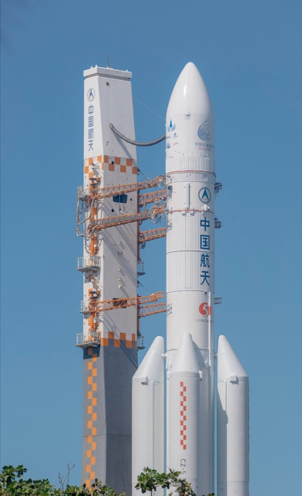

 今天，中国的首次自主火星探测计划“天问一号”发射成功！标志着中国也向深空探测领域迈出了自己的第一步，很巧合的是，也是在这个假期，我开始了在中科院国家空间科学中心的张艺腾研究员的指导下的关于火星的研究。很开心能与张老师合作，对于我这样的小白与菜鸡，能与张老师一起研究十分荣幸！

 “天问一号”虽然还未完全成功，但我对它的未来十分期待。因为在关于Mars的相关文献中我发现，几十年以来关于Mars的重大发现与理论基本都是国外的学者的研究成果，我感受到了中国在空间探测与研究领域的不足。“天问一号”无疑是我们迈出的重要一步，未来中国也会逐步向空间探测大国迈进。作为“researcher”，我肯定希望在未来能够运用到“天问一号”的数据来对Mars进行研究，用自己的数据做出属于自己的原创研究，这对科技工作者来说无疑是最大的幸福。希望“天问一号”能够逐步克服接下来的各种困难，在明年2月成功开启属于我们自己的“火星之旅”！

 Today, the first Mars mission of China "Tianwen" was successfully launched! It marks China has made the first step to planetray exploration. Luckily, at this special moment, I began my research project on Mars under the supervision of Dr. Yiteng Zhang at National Space Science Center. I feel fortunate to have the opportunity to work with Dr. Zhang, as a rookie in this field, I still have a long way to go, but I believe I can learn a lot by working with Dr. Zhang.

 The "Tianwen" mission just started its first step, but I am looking forward to its future. Recently I read some research articles of Mars, and found out that most of new findings about Mars were discoverd by scientists of developed countries like USA. We still have a long way to go in the field of space expolration. But this mission is an important step for us, we will have more space missions to the deeper space. As a "researcher", I hope I can discover some interesting facts of Mars by analyzing the data from "Tianwen" in the future, it is surely a great pleasure to discover new things with your own spacecraft data. I wish "Tianwen" can overcome all the difficulties on its way to Mars, and help begin our new trip on Mars!  

 

 <em> China's first Mars mission "Tianwen", to explore more about Mars.</em> 

